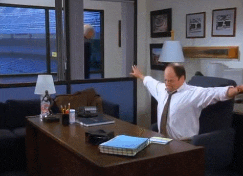
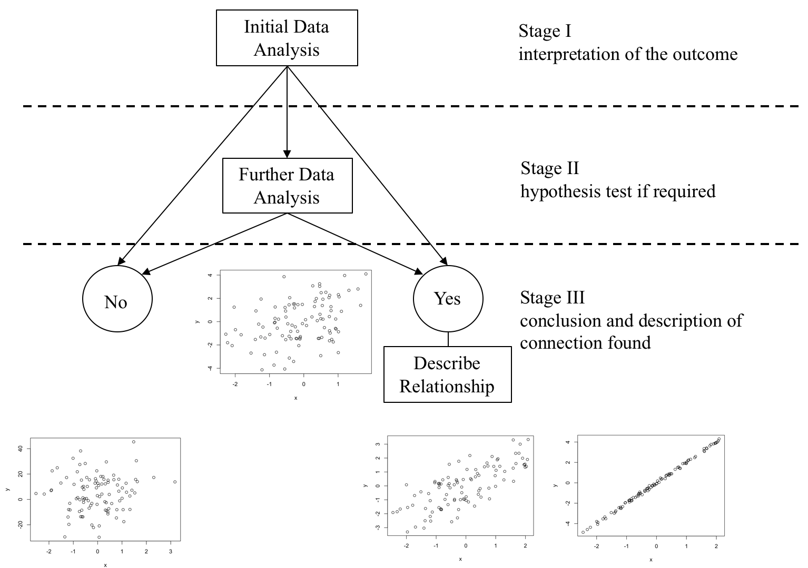
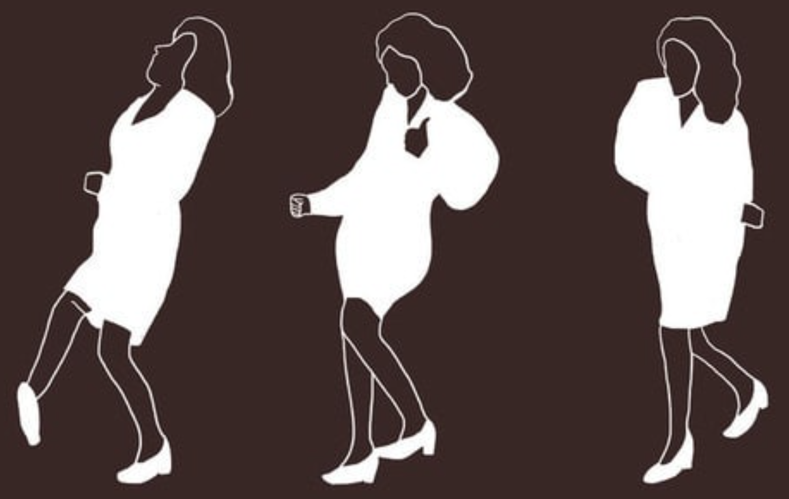
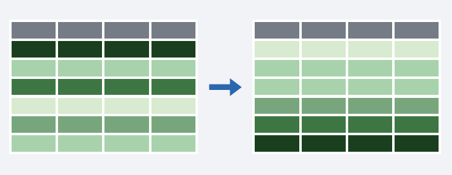
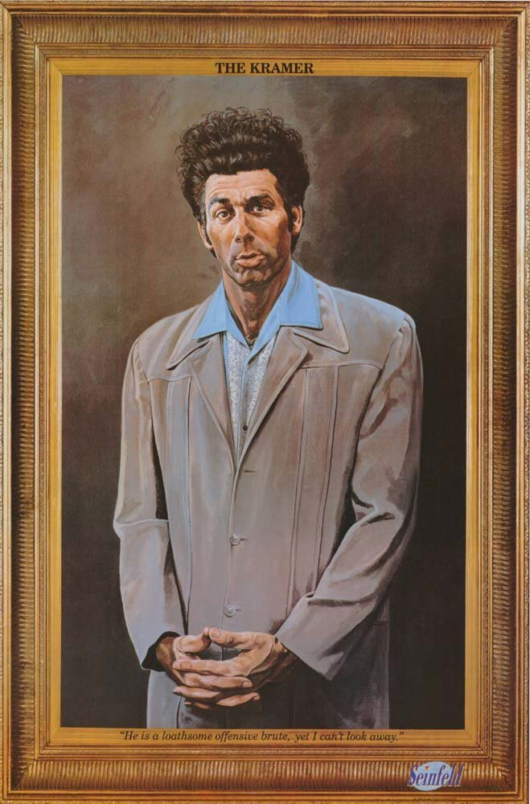

```{r setup, include=FALSE}
options(htmltools.dir.version = FALSE)
```
background-image: url(https://upload.wikimedia.org/wikipedia/commons/c/c1/Rlogo.png)
???

Image credit: [Wikimedia Commons](https://commons.wikimedia.org/wiki/File:Rlogo.png)
---
class: inverse, center, middle

#R Workshop: part I
## Hi, Zdravo, Ciao! Welcome to the Data Science Story Telling with R! Let me introduce you to our team:

- Hi, I'm Tanja! A Data Scientist at [DataTeka](https://datateka.com/) and a proud mum of a four year old girl called Mila. When I don't do #rstats I like to cook. 
- Hi, I'm Katarina! I work at [Startit](https://startit.rs/). When I don't do #rstats I like to spend time with my friends hiking and mountain climbing. 
##Sep 2018

---
## How's the day planned

- There will be a little bit of instruction, and a few exercises, then some more instruction, and some more exercises, some reading, some more exercises, ...

- The goal for the day is to work with your team and mentor to make a web app for looking at data.

- We are going to learn about the software R, and the language of data analysis. There's a lot of things to learn. It's ok if you can't remember it all. Most important thing is to have fun and play, break things and fix them, try out new stuff!

- We will have breaks whenever you feel you want them - there are snacks, drinks and pizzas 🍕😋.

### CODE of CONDUCT:

1. Be positive
2. Be inclusive
3. Ask for help, and give some help

---

## MATERIALS for WORKSHOP:

To download workshop's material please go to:
<https://github.com/DataTeka/klikrws>

```{r, out.width = "750px", fig.align = 'center', echo=FALSE}

```


---
class: center, middle
# How do we do it? 🤔

###Steps of a typical data science project:
```{r, out.width = "500px", echo=FALSE}
knitr::include_graphics("images/Program_HW.png")
```
---
class: inverse, center, middle

#Get Started 🤫😴
```{r, out.width = "600px", echo=FALSE}

```

---
## Write R Code 😇🎶

To start using **R** you need to:

1) Install [R](https://cran.r-project.org/) [(and RStudio)](https://www.rstudio.com/products/rstudio/download/#download)

2) Launch it and set your working directory: letting R know where to find all of your files.

- **On a mac**, it'd look like this
`setwd("~/Documents/DS_Story")`

- **On a pc**, it might look like this
`setwd("C:/Documents/DS_Story")`

3) Start writing **R** code!

**Tip**💡:
- When start working on a new R code/R Project in [RStudio IDE](https://support.rstudio.com/hc/en-us/sections/200107586-Using-the-RStudio-IDE) use 
***File -> New Project*** 
This way your working directory would be set up when you start a new project and it will save all your files in it. Next time you open your project it would set project's directory as a working directory... It would help you with so much [more](https://support.rstudio.com/hc/en-us/articles/200526207-Using-Projects). 

---
class: center, middle

##[RStudio IDE Cheatsheet](https://www.rstudio.com/wp-content/uploads/2016/01/rstudio-IDE-cheatsheet.pdf)

```{r, out.width = "500px", echo=FALSE}
knitr::include_graphics("images/RStudio.png")
```

***Top Left:*** Code Editor;
--

***Bottom Left:*** R Console;
--

***Top Right:*** Environment
--

***Bottom Right:*** Plots and Files
---
#Dataset


Today we will examine [Olympic games data](https://www.kaggle.com/heesoo37/120-years-of-olympic-history-athletes-and-results) that include data about the Games from Athens 1896 to Rio 2016.
The file `athlete_events.csv` contains $271,116$ rows and $15$ columns. Each row corresponds to an individual athlete competing in an individual Olympic event (athlete-events). 

```{r, out.width = "800px", echo=FALSE}

```

**Note** 💡: there are 15 columns, each of which we call a **variable**. 
---
class: inverse, center, middle
  
  # Let's get introduced to some basic statistical concepts 🧐
---
##What will I learn in Part I?

During Part I of the workshop you will be introduced to some basic R syntax and a set of methods that enable data to be explored using `R` with the **objective** 
- of summarising and understanding the main features of the variables contained within the data and 

- to investigate the nature of any linkages between the variables that may exist.

The starting point is to understand **what data is**.
- What is the **population**?
- Why do we use **samples**?

So, from where do I start?

- **Do I understand the problem** under investigation and are the objectives of the investigation clear? *The only way to obtain this information is to ask questions, and keep asking questions until satisfactory answers have been obtained.*

- Do I understand exactly **what each variable is measuring/recording?**
---
#Describing Variables

A starting point is to examine the characteristics of each individual variable in the data set. 

The way to proceed depends upon the type of variable being examined.

**Classification of variable types**

The variables can be one of two broad types:

-	Attribute variables 

-	Measured variables
.pull-left[
**attribute**

gender

days in a week
]
.pull-right[
**measured**

age

weight
]
---
##The Concept of Statistical Distribution

**The concept of the statistical distribution is central to statistical analysis.**

This concept relates to the population and conceptually assumes that we have perfect information, the exact composition of the population is known. 

.pull-left[
**attribute:**
```{r tidy=FALSE, echo=FALSE}
barplot(c(5,9),
	names.arg=c("Category 1","Category 2"),
	ylim=c(0,10),
	col=c("#CDB79E","darkolivegreen3"),
	ylab="Count of items")
```
]

.pull-right[
**measured:**
```{r tidy=FALSE, echo=FALSE}
x<-seq(-3,3,length=200)
s = 1
mu = 0
y <- (1/(s * sqrt(2*pi))) * exp(-((x-mu)^2)/(2*s^2))
plot(x,y, type = "l", lwd = 2, axes = FALSE, xlab = "", ylab = "")
axis(1, at = -3:3, labels = c("-3", "-2", "-1std", "mean", "1std", "2", "3"))
abline(v = 0, col="red", lwd=2, lty=2)
abline(v = c(-1,1), col="blue", lwd=2, lty=3)
```
]
---
class: center, middle
##Summary Statistics

```{r echo=FALSE, tidy=FALSE}
nf <- layout(mat = matrix(c(1,2),2,1, byrow=TRUE),  height = c(3,1))
xseq<-seq(-4,4,.01)
densities<-dnorm(xseq, 0,1)
par(mar=c(3.1, 3.1, 1.1, 2.1))
plot(xseq, densities, col="darkgreen",xlab="", ylab="Density", type="l",lwd=2, cex=2, main="PDF of Standard Normal", cex.axis=.8, axes = FALSE)
axis(1, at = -4:4, labels = c("min", "-3", "Q1", "-1", "median", "1", "Q3", "3", "max"))
abline(v = 0, col="red", lwd=2, lty=2)
abline(v = c(-2,2), col="blue", lwd=2, lty=3)
abline(v = c(-4,4), col="black", lwd=2, lty=3)
boxplot(xseq, horizontal=TRUE,  outline=TRUE,ylim=c(-4,4), frame=F, col = "darkolivegreen3", width = 10)
```
---
##Investigating relationship between variables

One of the key steps required of the Data Analyst is to investigate the relationship between variables. This requires a further **classification of the variables** contained within the data, as either a <span style="color:darkred">**response**</span> variable or an <span style="color:darkred">**explanatory**</span> variable.  

A **response** variable is a variable that measures either directly or indirectly the objectives of the analysis.

An **explanatory** variable is a variable that may influence the response variable.
---
class: center, middle
##Bivariate Relationships
```{r, out.width = "500px", echo=FALSE}

```
---
class: center, middle
##DA Methodology
```{r, out.width = "600px", echo=FALSE}
knitr::include_graphics("images/DaMethodology.png")
```

Note that the 'Further Data Analysis' stage may or may-not be required depending on the outcome of the 'Initial Data Analysis' at stage 1. 
---
class: center, middle
##Measured Vs Attribute(2-levels)
```{r, out.width = "700px", echo=FALSE}

```
---
class: center, middle
##Measured Vs Measured
```{r, out.width = "700px", echo=FALSE}

```
---
##Further Data Analysis

If the <span style="color:darkblue">'**Initial Data Analysis**'</span> is <span style="color:blue">*inconclusive*</span> then <span style="color:darkblue">'**Further Data Analysis**'</span> is required. 

The 'Further Data Analysis' is procedure that enables a decision to be made, based on the sample evidence, as to one of two outcomes:  
- There is no relationship
-	There is a relationship

These statistical procedures are called <span style="color:darkred">**hypothesis tests**</span>, which essentially <span style="color:red">*provide a decision rule for choosing between one of the two outcomes*</span>: "There is no relationship" or "There is a relationship" based on the sample evidence.

All hypothesis tests are carried out in four stages:
- Stage 1:		Specifying the hypotheses.

- Stage 2:		Defining the test parameters and the decision rule.

- Stage 3:		Examining the sample evidence.

- Stage 4:		The conclusions.

---
class: inverse, center, middle

#How do we do it in R?: part II 🤓 
##klikR
##September 2018
  
---
##Before Tidyverse R, there is Base R!
When you download and install **R** for the first time, you are installing **the Base R** software. **Base R** contains most of the functions you’ll use on a daily basis: `mean()`, `subset()`...

To learn about **R**'s basic operations, data structures and base functions you could look at one of the R-Ladies Manchester's handouts: [Introduction to base R](https://tanjakec.github.io/blog/introduction-to-r/).

If you want to access data and code written by other people, you’ll need to install it as a **package**. An **R package** is a bundle of functions (code), data, documentation, vignettes (examples), stored in one neat place.

"In **R**, the fundamental unit of shareable code is the package." [Hadley Wickham](http://r-pkgs.had.co.nz/intro.html)  
---
##The verse! 😇🎶
An opinionated collection of **R packages** for data science.

[`install.packages("tidyverse")`](https://www.tidyverse.org/)

[`library(tidyverse)`](https://www.tidyverse.org/packages/)

- Have you tried learning data science by reading books? 

📖📘 [**R for Data Science**](http://r4ds.had.co.nz/) by Garrett Grolemund & Hadley Wickham

- Have you tried learning data science by posting your questions and discussing it with other people within the R community?

👥💻📊📈🗣 [**RStudio Community**](https://community.rstudio.com/)
---
##The <span style="color:blue">`dplyr`</span> Package 🗜🛠🔩⚙️: 
provides a “<span style="color:red">grammar</span>” (the verbs) for data manipulation and for operating on data frames. The **key opertor and the esential verbs** are :

- <span style="color:blue">`%>%`</span>: **the “pipe” operator** used to connect multiple verb actions together into a pipeline.

- <span style="color:blue">`select()`</span>: return a subset of the columns of a data frame.

- <span style="color:blue">`mutate()`</span>: add new variables/columns or transform existing variables.

- <span style="color:blue">`filter()`</span>: extract a subset of rows from a data frame based on logical conditions.

- <span style="color:blue">`arrange()`</span>: reorder rows of a data frame according to single or multiple variables.

- <span style="color:blue">`summarise()`</span> / <span style="color:blue">`summarize()`</span>: reduces each group to a single row by calculating aggregate measures. 
---
##The Olimpic Games Data

A historical dataset on the modern Olympic Games, including all the Games from Athens 1896 to Rio 2016.

The main data frame olympics has **271,116 rows** and **15 variables**:
- **ID** - Unique number for each athlete
- **Name** - Athlete's name
- **Sex** - M or F
- **Age** - Integer
- **Height** - In centimeters
- **Weight** - In kilograms
- **Team** - Team name
- **NOC** - National Olympic Committee 3-letter code
- **Games** - Year and season
- **Year** - Integer
- **Season** - Summer or Winter
- **City** - Host city
- **Sport** - Sport
- **Event** - Event
- **Medal** - Gold, Silver, Bronze, or NA

---

##The Olimpic Games Data
```{r, echo = TRUE, warnings = TRUE, message = FALSE}
# import csv data file into R
olympic <- read.csv("data/athlete_events.csv")
olympic[1:5,]
```

**Note** 💡: we are reading only first 5 raws and there are 15 columns!
---
##Setting up Working Environment 💡

Install necessary packages you will be working with!

```{r eval=FALSE}
install.packages("dplyr", repos = "http://cran.us.r-project.org")
install.packages("ggplot2", repos = "http://cran.us.r-project.org")
install.packages("DT", repos = "http://cran.us.r-project.org")
```

And now we're ready to start practicing Elain's Dance!!! 😃🎵🎶

```{r, out.width = "300px", fig.align = 'center', echo=FALSE}

```
---
## First look at the data: <span style="color:blue">`dim()`</span> & <span style="color:blue">`head()`</span>

```{r, warnings=FALSE, message=FALSE}
dim(olympic)
head(olympic, n = 3)
```

This is hard to read...?! 😕

---
##Examine the structure of the data: <span style="color:blue">`str()`</span>
```{r}
str(olympic) 
```

The **output could look messy** and it might not fit the screen when dealing with a big data set that has lots of variables! 🤪
---
##Do it in a tidy way: <span style="color:blue">`glimpse()`</span>

```{r, warnings=FALSE, message=FALSE}
suppressPackageStartupMessages(library(dplyr))
glimpse(olympic) 
```
Ahhh... this 👀 better! 😅

---
##The pipeline operater: <span style="color:blue">`%>%`</span> ⛓⛓⛓
<pre>
**Left Hand Side (LHS)**   <span style="color:blue">`%>%`</span>    **Right Hand Side (RHS)**
</pre>
<pre>
<span style="color:blue">x %>% f(..., y)</span> 

<span style="color:blue">    f(x,y)</span>
</pre>

The "pipe" passes the **result** of the **LHS** as the 1st operator argument of the **function** on the **RHS**

<pre>
<span style="color:blue">3 %>% sum(4)</span>      <==>      <span style="color:blue">  sum(3, 4)</span>
</pre>

<span style="color:blue">`%>%`</span> is very practical for chaining together multiple <span style="color:blue">`dplyr`</span> functions in a sequence of operations.
---
##pick variables by their names: <span style="color:blue">`select()`</span>,
```{r, out.width = "450px", echo=FALSE}
knitr::include_graphics("images/select().png")
```

- <span style="color:blue">`starts_with("X")`</span> every name that starts with "X".

- <span style="color:blue">`ends_with("X")`</span> every name that ends with "X".

- <span style="color:blue">`contains("X")`</span> every name that contains "X".

- <span style="color:blue">`matches("X")`</span> every name that matches "X", where "X" can be a regular expression.

- <span style="color:blue">`num_range("x", 1:5)`</span>  the variables named x01, x02, x03, x04, x05.

- <span style="color:blue">`one_of(x)`</span> => every name that appears in x, which should be a character vector.

---
##Select your variables 

Use `olympic df` to select the variable(s)

1) that ends with letter `t`

2) starts with letter `S`. Try to do this selection using base R.  

Check out all the [`select()`](https://dplyr.tidyverse.org/reference/select_helpers.html) options that are available.


---
##Solutions:
```{r, echo = TRUE}
end_t <- select(olympic, ends_with("t"))
head(end_t, n = 1)
beg_S <- select(olympic, starts_with("S"))
head(beg_S, n = 1)
```
of course all of this could be done using **base R** like for example:
```{r, echo = TRUE}
beg_S_base <- olympic[c("Sex", "Season", "Sport")]
head(beg_S_base, n = 1) 
```
but it's less intuitive and often requires more typing. 
---
##Create new variables of existing variables: <span style="color:blue">`mutate()`</span>
```{r, out.width = "400px", echo=FALSE}
knitr::include_graphics("images/mutate().png")
```

It would allow you to add to the data frame `df` a new column, `z`, which is the multiplication of the columns `x` and `y`: `mutate(df, z = x * y)`.
If we would like to observe `BMI` of the athletes we could create a new column `BMI`. The BMI is universally expressed in kg/m2, resulting from mass in kilograms and height in metres.
**Note**💡: variable `**Height**` - In centimeters!

```{r, echo = TRUE}
olympic <- mutate(olympic, BMI = Weight / (Height/100)^2) 
head(olympic, n = 1)
```
Check [here](https://dplyr.tidyverse.org/reference/mutate.html) for more functionalities with mutate.
---

##Pick observations by their values: <span style="color:blue">`filter()`</span>
```{r, out.width = "450px", echo=FALSE}
knitr::include_graphics("images/filter().png")
```

There is a set of logical operators in **R** that you can use inside `filter()`:

- `x < y`: `TRUE` if `x` is less than `y`
- `x <= y`: `TRUE` if `x` is less than or equal to `y`
- `x == y`: `TRUE` if `x` equals `y`
- `x != y`: `TRUE` if `x` does not equal `y`
- `x >= y`: `TRUE` if `x` is greater than or equal to `y`
- `x > y`: `TRUE` if `x` is greater than `y`
- `x %in% c(a, b, c)`: `TRUE` if `x` is in the vector `c(a, b, c)`
- `is.na(x)`:  Is `NA`
- `!is.na(x)`: Is not `NA`
---
##Filter your data:

Use `olympic df` to filter:

1) only Serbian teams and save it as `olympicSR`

2) only Serbian teams from 2000 onward and save it as `olympicSR21c`

3) athletes whos wight is bigger then 100kg and height is over 2m.

Don't forget to **use `==` instead of `=`**! and
Don't forget the quotes ** `""` **
---
##Solutions:
```{r, echo = TRUE}
olympicSR <- filter(olympic, Team == "Serbia") 
dim(olympicSR)
```
```{r, echo = TRUE}
olympicSR21c <- filter(olympicSR,  Year >= 2000)
dim(olympicSR21c)
```
```{r, echo = TRUE}
big_athlete <- filter(olympic, Weight > 100 & Height > 200)
dim(big_athlete)
```
---
##Reorder the rows: <span style="color:blue">`arrange()`</span>
is used to reorder rows of a **d**ata **f**rame (df) according to one of the variables/columns.

```{r, out.width = "300px", echo=FALSE}

```

- If you pass `arrange()` a character variable, **R** will rearrange the rows in alphabetical order according to values of the variable. 

- If you pass a factor variable, **R** will rearrange the rows according to the order of the levels in your factor (running `levels()` on the variable reveals this order).
---
##Arranging your data
1) Arrange Serbian athletes in `olympicSR21c` `df` by `Height` in ascending and descending order.

2) Using `olympicSR df`
  - Find the youngest athlete.
  
  - Find the heaviest athlete.
---
##Solution 1):
```{r, echo = TRUE}
olympicSR21c_hs <- arrange(olympicSR21c, Height)
head(olympicSR21c_hs, 2)
olympicSR21c_ht <- arrange(olympicSR21c, desc(Height)) #<<
head(olympicSR21c_ht, 2)
```
---
##Solution 2):
```{r, echo = TRUE}
head(arrange(olympicSR, Age), 5)

```
---
```{r, echo = TRUE}
head(arrange(olympicSR, desc(Weight)), 5)
```
---
##Collapse many values down to a single summary: <span style="color:blue">`summarise()`</span>
```{r, out.width = "450px", echo=FALSE}

```

- uses the same syntax as `mutate()`, but the resulting dataset consists of a single row instead of an entire new column in the case of `mutate()`. 

- builds a new dataset that contains only the summarising statistics.

Use `summarise()`:

1) to print out a summary of `olypicSR` `df` containing two variables: max_Age and max_BMI.

2) to print out a summary of `olypicSR` `df` containing two variables: mean_Age and mean_BMI.

Explore more about [`summarise()`](https://dplyr.tidyverse.org/reference/summarise.html).
---
##Solution: Summarise your data

```{r, echo = TRUE}
summarise(olympicSR, max_Age = max(Age), max_BMI = max(BMI))
```

```{r, echo = TRUE}
summarise(olympicSR, mean_Age = mean(Age), mean_BMI = mean(BMI))
```
---
class: inverse, center, middle

## Let's `%>%` all up!

Confer with your team members.

What relationship do you expect to see between:

  `Age` and `Height` of the athletes?
  
  `Age` and `BMI`?

---

```{r, out.width = "750px", echo=FALSE, fig.align = 'center'}
knitr::include_graphics("images/pipe_short_cut.png")
```
---
**Do you know what this code does?**
```{r, echo = TRUE, eval = FALSE,  fig.height = 5, fig.width = 8, fig.align = 'center'}
olympicSR_pipe <- olympic %>%
   filter(Team == "Serbia" & Year > 2000) %>%
   mutate(BMI = Weight / (Height/100)^2)
plot(olympicSR_pipe$Age, olympicSR_pipe$Height, cex = 0.5, col = "red")
```

```{r, out.width = "250px", echo=FALSE, fig.align = 'center'}

```
---
```{r, echo = FALSE,  fig.height = 7, fig.width = 8, fig.align = 'center'}
olympicSR_pipe <- olympic %>%
   filter(Team == "Serbia" & Year > 2000) %>%
   mutate(BMI = Weight / (Height/100)^2)
plot(olympicSR_pipe$Age, olympicSR_pipe$Height, cex = 0.5, col = "red")
```
---
class: inverse, center, middle

##We have learnt all of Elain's moves!!! 😃🎵🎶

```{r, out.width = "300px", echo=FALSE}
knitr::include_graphics("images/ElainDanceII.png")
```
---
class: inverse, center, middle

## Can we make it look better?: ggplot; part III 😁
##klikR
##September 2018
---
class: inverse, center, middle

#"The simple graph has brought more information to the data analyst’s mind than any other device."
John Tukey
---
## grammar of graphics
Enables you to specify building blocks of a plot and to combine them to create graphical display you want. There are 8 building blocks:

- data

- aesthetic mapping

- geometric object

- statistical transformations

- scales

- coordinate system

- position adjustments

- faceting
---
##<span style="color:blue">ggplot()</span>
1. "Initialise" a plot with `ggplot()`
2. Add layers with `geom_` functions

```{r, echo = TRUE, fig.height = 3, fig.width = 8, fig.align = 'center'}
library(ggplot2)
ggplot(olympicSR_pipe, aes(x = Age, y = Height)) +
  geom_point(col ="red")
```
**Tip**: You can use the following code template to make graphs with [`ggplot2`](https://ggplot2.tidyverse.org):

```{r, eval = FALSE}
ggplot(data = <DATA>, (mapping = aes(<MAPPINGS>)) +
  <GEOM_FUNCTION>()
```
---
#<span style="color:blue">ggplot()</span> gallery
Run the following code to see what graphs it's going to produce.

```{r, echo = TRUE, eval = FALSE, warnings=FALSE, message=FALSE}
ggplot(data = olympic, mapping = aes(x = Height), binwidth = 10) +
  geom_histogram()
#
ggplot(data = olympic, mapping = aes(x = Height)) +
  geom_density()
#
ggplot(data = olympic, mapping = aes(x = Season, color = Sex)) +
  geom_bar()
#
ggplot(data = olympic, mapping = aes(x = Sex, fill = Season)) +
  geom_bar()
```

You can see a nice list of all kinds of `ggplot`s at <http://r-statistics.co/Top50-Ggplot2-Visualizations-MasterList-R-Code.html>

---
##Confer with your neighbours:

**Does the BMI of the athletes depend upon their Age?**
$$\hat{y}=\hat{\beta_0} + \hat{\beta_1} x + e$$
Run this code in your console to fit the model `Age` vs `BMI`.

Pay attention to spelling, capitalization, and
parentheses!
```{r, echo = TRUE, eval=FALSE, warning= FALSE}
m1 <- lm(olympic$BMI ~ olympic$Age)
summary(m1)
```
---
**Can you answer the question usig the output of the fitted model?**
```{r, echo = TRUE, warning= FALSE}
m1 <- lm(olympic$BMI ~ olympic$Age)
summary(m1)
```
---
## Your turn!

Use `olympic` data.

**Does the Weight depend upon Age?**

1) Data set is big, hence let us use a sample of 10,000 athletes (tip: `sample_n(df, n)`)

2) Produce a scattep plot: what does it tell you?

3) Fit a regression model: is there a relationship? How strong is it?
Is the relationship linear? What conclusion(s) can you draw?

4) What are the other questions you could ask; could you provide the answers to them?
---
## Possible Solution Q1 & Q2: sample and scatter plot
```{r, echo = TRUE, warning= FALSE, fig.height = 4, fig.width = 8, fig.align = 'center'}
sam_olymp <- sample_n(olympic, 10000) 
ggplot(sam_olymp, aes(x = Age, y = Weight)) +
    geom_point(alpha = 0.2, shape = 21, fill = "blue", colour="black", size = 5) +
  geom_smooth(method = "lm", se = F, col = "maroon3") +
  geom_smooth(method = "loess", se = F, col = "limegreen") 
```
---
## Possible Solution Q3: simple regression model
```{r, echo = TRUE, warning = FALSE}
my.model <- lm(sam_olymp$Weight ~ sam_olymp$Age)
summary(my.model)
```
---
## Adding layers to your <span style="color:blue">`ggplot()`</span>

```{r, echo = TRUE, eval = FALSE}
ggplot(sam_olymp, aes(x = Age, y = Weight, col = "red")) +
      geom_point(alpha = 0.2, shape = 21, fill = "blue", colour="black", size = 5) +
  geom_smooth(method = "lm", se = F, col = "maroon3") +
  geom_smooth(method = "loess", se = F, col = "limegreen") +
  labs (title= "Age vs Weight", 
        x = "Age", y = "Weight") +
  theme(legend.position = "none", 
        panel.border = element_rect(fill = NA, 
                                    colour = "black",
                                    size = .75),
        plot.title=element_text(hjust=0.5)) +
  geom_text(x = 80000, y = 125, label = "regression line", col = "maroon3") +
  geom_text(x = 90000, y = 75, label = "smooth line", col = "limegreen")
```
---
## Voila
```{r, echo = FALSE, warning= FALSE, fig.height = 7, fig.width = 10, fig.align = 'center'}
ggplot(sam_olymp, aes(x = Age, y = Weight, col = "red")) +
      geom_point(alpha = 0.2, shape = 21, fill = "blue", colour="black", size = 5) +
  geom_smooth(method = "lm", se = F, col = "maroon3") +
  geom_smooth(method = "loess", se = F, col = "limegreen") +
  labs (title= "Age vs Weight", 
        x = "Age", y = "Weight") +
  theme(legend.position = "none", 
        panel.border = element_rect(fill = NA, 
                                    colour = "black",
                                    size = .75),
        plot.title=element_text(hjust=0.5)) +
  geom_text(x = 80000, y = 125, label = "regression line", col = "maroon3") +
  geom_text(x = 90000, y = 75, label = "smooth line", col = "limegreen")

```
---
## **There is a challenge:** 

- `dplyr`'s `group_by()` function enables you to group your data. It allows you to create a separate df that splits the original df by a variable.
- `datatable()` from `DT` package enables you to display as table on HTML page an R data object that could be filtered, arranged etc.
- `boxplot()` function produces boxplot(s) of the given (grouped) values.

Knowing about `group_by()` and `DT::datatable()` functions, coud we find out number of medals per each team?
```{r, echo = TRUE, eval = FALSE, warnings=FALSE, message=FALSE, fig.height = 6, fig.width = 8, fig.align = 'center'}
olympic %>% 
  filter(!is.na(Medal)) %>% 
  group_by(Team, Medal) %>% 
  summarize(cases=n()) %>% 
  DT::datatable()
```

Could you find the number of medals per each team for the last Rio games?
**Hint**💡: Games in Rio were in 2016!
---
## Possible Solution: 
```{r, echo = FALSE, eavl = TRUE}
olympic %>% 
  filter(!is.na(Medal)) %>% 
  group_by(Team, Medal) %>% 
  summarize(cases=n()) %>% 
  DT::datatable()
```
---
**Exercise:** 💪 Let us Visualise data about number of female and male athletes from ex YU countries available in the data set: "Bosnia and Herzegovina", "Croatia", "Serbia", "Serbia and Montenegro", "Montenegro", "Slovenia". 

First we would need to get the data we want to be presented on a graph.
```{r, echo = TRUE, warning= FALSE, fig.height = 4, fig.width = 8, fig.align = 'center'}
exyu <- olympic %>% 
  filter(Team %in% c("Bosnia and Herzegovina", "Croatia", "Serbia", "Serbia and Montenegro", "Montenegro", "Slovenia")) %>% 
  group_by(Team, Sex) %>% 
  summarize(total = n()) #<< 
exyu
```
---
**How do we plot this?** 🤔
```{r, echo = TRUE, eval = FALSE}
# we need a bar chart with each team on the x axis and number of male and female athlethes on the y axis.
ggplot(data = exyu, aes(x = Team, y = total, fill = Sex)) +
  geom_bar(stat="identity",  position="dodge", col = "black") +
# to make it read easier we will flip x & y coordinates
    coord_flip() +
# we will add description for x and y axies and title and subtitle  
    labs(x="ex YU country", y="No of athletes", 
      title = "Comparisons of M and F representatives in exYU Teams",
      subtitle = "for klikR workshop",
      caption = "Data from: kaggle - 120 years of Olympic history") +
# add the border on the graph  
    theme(panel.border = element_rect(fill = NA, colour = "black", size = 1)) +
#remove the grid lines
    theme(plot.title = element_text(size = 14, vjust = 2),
      panel.grid.major = element_blank(),
      panel.grid.minor = element_blank(), 
      axis.line = element_blank())
```
---
**Our graph!** 😇😎

```{r, echo = FALSE, warnings=FALSE, message=FALSE, fig.height = 7, fig.width = 9, fig.align = 'center'}
# we need a bar chart with each team on the x axis and number of male and female athlethes on the y axis.
ggplot(data = exyu, aes(x = Team, y = total, fill = Sex)) +
  geom_bar(stat="identity",  position="dodge", col = "black") +
# to make it read easier we will flip x & y coordinates
    coord_flip() +
# we will add description for x and y axies and title and subtitle  
    labs(x="ex YU country", y="No of athletes", 
      title = "Comparisons of M and F representatives in exYU Teams",
      subtitle = "for klikR workshop",
      caption = "Data from: kaggle - 120 years of Olympic history") +
# add the border on the graph  
    theme(panel.border = element_rect(fill = NA, colour = "black", size = 1)) +
# remove the grid lines
    theme(plot.title = element_text(size = 14, vjust = 2),
      panel.grid.major = element_blank(),
      panel.grid.minor = element_blank(), 
      axis.line = element_blank())
```
---
class: inverse, center, middle

##Let's do Elain's Dance!!! 😃🎵🎶

```{r, out.width = "500px", echo=FALSE}
knitr::include_graphics("images/Elain_dance.gif")
```
---
## useful links: 

cheatsheets:

- [data-wrangling-cheatsheet](https://www.rstudio.com/wp-content/uploads/2015/02/data-wrangling-cheatsheet.pdf)

- [ggplot2-cheatsheet](https://www.rstudio.com/wp-content/uploads/2015/03/ggplot2-cheatsheet.pdf)

websites:

- [tidyverse, visualization, and manipulation basics](https://www.rstudio.com/resources/webinars/tidyverse-visualization-and-manipulation-basics/)

- [ggplot part of tidy verse](http://ggplot2.tidyverse.org/index.html)

- [Introduction to R graphics with ggplot2](http://tutorials.iq.harvard.edu/R/Rgraphics/Rgraphics.html#introduction)
---
class: inverse, center, middle


#R Workshop: part IV
##klikR
##September 2018
---
#R Markdown 💻📊📈📃


Enables you to:
- save and execute code and display its output
- create high quality reports that could include [LaTeX](https://www.latex-project.org/) equations

[R Markdown](https://rmarkdown.rstudio.com/) documents are fully reproducable and support many static and dynamic output formts, to name a few: PDF, HTML, MS Word, Beamer... 

It is a variant of [Markdown](https://daringfireball.net/projects/markdown/) that has embedded **R code chunks** (denoted by three backticks), to be used with [knitr](https://yihui.name/knitr/) to make it easy to create reproducible web-based reports. 

To use **R Markdown** you will need to install package from [CRAN](https://cran.r-project.org/) and load it with:

```{r eval=FALSE, warnings=FALSE, message=FALSE}
install.packages("rmakdown",repos = "http://cran.us.r-project.org")
suppressPackageStartupMessages(library(rmarkdown))
```
---
class: middle

```{r, out.width = "1000px", echo=FALSE}
knitr::include_graphics("images/RMarkdown.png")
```

You would deffinitely find usefull the following:

- [The R Markdown Cheatsheet](https://ntaback.github.io/UofT_STA130/rmarkdown-2.0.pdf)

- [The R Markdown Reference Guide](https://www.rstudio.com/wp-content/uploads/2015/03/rmarkdown-reference.pdf)
---
#Starting with RMarkdown

**<span style="color:red">Task 1</span>:**
Open the file `RMarkdown_Intro.Rmd`

- Change the title of the Markdown Document from `My First Markdown Document` to `RMarkdown Introduction`.

-  Click the **"Knit"** button to see the compiled version of your sample code.
---
class: inverse, center, middle

##Congratulations! You’ve just Knitted your $1^{st}$ Rmd document!!!! 👍😃

```{r, out.width = "300px", echo=FALSE}
knitr::include_graphics("images/kramer_congrats.gif")
```
---
## Basic Text editing

**<span style="color:red">Task 2</span>:**
Let’s formatted this document further by

- Changing the author of the document to your own name.

- Rewriting the first sentence of the document to say "This is my first R Markdown document."

- Recompiling the document so you can see your changes?
---
##Adding a link

You can turn a word into a link by surrounding it in **hard brackets: [ ]** and then placing the link behind it in **parentheses: ( )**, like this:

[RStudio] (www.rstudio.com)

**<span style="color:red">Task 3</span>:**
Make GitHub in the following paragraph link to https://github.com/DataTeka/DSStory
---
#Text formatting 

To embed formatting instructions into your document using Markdown, you
would surround text by:
- one asterisks to make it italic: *italic*;
- two asterisks to make it bold: **bold** and
- backticks to make it monospaced: `monospaced`.

To make an ordered list you need to place each item on a new line after a
number followed by a period followed by a space:
1. order list
2. item 2
Note that you need to place a blank line between the list and any paragraphs
that come before it.
---
##**<span style="color:red">Task 4</span>:**

- Make the following paragraph (line #20) in your Rmd document look like this:

The variables can be one of two broad types:

1) **Attribute variable**: has its outcomes described in terms of its characteristics or
attributes;

2) **Measured variable**: has the resulting outcome expressed in numerical terms.

- Make word Knit in the following paragraph bold.
---
#Embeding the `R` code 
To embed an R code chunk you would use three back ticks:

` ```{r} `

` chunk of code`

` ``` `

**<span style="color:red">Task 5</span>**: Replace the `cars` data set with the `olympic` data set (but don't forget to read the data!).

You can also embed plots by setting `echo = FALSE` to the code chunk to
prevent printing of the R code that generates the plot:

` ```{r, echo=FALSE} `

` chunk of code`

` ``` `

**<span style="color:red">Task 6</span>**: Replace the base boxplot of mpg vs. cyl by one of the ggplot you have created earlier (remember to upload the necessary packages!).
---
##Adding **LaTex** equations

Finally, if you wish to add mathematical equations to your Markdown
document you can easily embed LaTeX math equations into your report.

To display equation in its own line it needs to be surrounded by double dollar
symbol `$$` `y = a + bx` `$$`, or to embed an equation in line within the text you
would use only one dollar symbol: `$y = a + bx$`.

**<span style="color:red">Task 7</span>**: Display the equation into it’s own line.
---
class: inverse, center, middle

#Congratulations! You have got the basics to start creating your own fabulous dynamic documents… !!!! 👍😃

```{r, out.width = "300px", echo=FALSE}
knitr::include_graphics("images/giphy.gif")
```

##💻📊📈📃🤓🤪🤩😎
**Useful Links**:  

R Markdown:
<http://www.stat.cmu.edu/~cshalizi/rmarkdown/>

RStudio R Markdown:
<https://rmarkdown.rstudio.com>


[RStudio Cheatsheets](https://www.rstudio.com/resources/cheatsheets/)

```{r, out.width = "300px", echo=FALSE, fig.align = 'center'}
knitr::include_graphics("images/SeinfeldDance.gif")
```

---

class: center, middle

# Thanks!

[www.datateka.com](www.datateka.com) 

[tanjakec.github.io](tanjakec.github.io)

@DataTeka 

@Tatjana_Kec


Slides created via the R package [**xaringan**](https://github.com/yihui/xaringan).

The chakra comes from [remark.js](https://remarkjs.com), [**knitr**](http://yihui.name/knitr), and [R Markdown](https://rmarkdown.rstudio.com).
